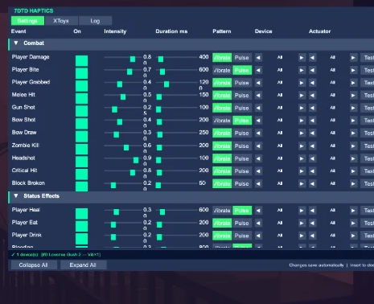

# 7 Days to Vibe

A [BepInEx](https://github.com/BepInEx/BepInEx) plugin that drives haptic devices from in-game events in **7 Days to Die**. Take a zombie hit, fire a gun, get bitten, level up, survive a blood moon — and feel it.

Two output paths fire in parallel for every event:

- **Intiface / Buttplug** — local USB/Bluetooth devices via [Intiface Central](https://intiface.com/central/) (vibration, linear/thrust, rotation). ~5 ms latency.
- **XToys** — cloud-connected toys (e.g. DG-LAB Coyote e-stim) via an [xtoys.app](https://xtoys.app) webhook. ~100–500 ms latency.

> ⚠️ **Adult content.** This mod integrates with adult haptic hardware. 18+.



---

## Features

- **49 events** across 6 categories — Combat, Status Effects, World Events, Activities, Vehicles, Stealth.
- **Per-event tuning** — enable/disable, intensity (0–1), duration, pattern (vibrate / pulse), target device slot, and actuator (vibrate / linear / rotate, by index).
- **In-game config panel** — open with **`Insert`**. Live device status, per-event **Test** buttons, a colour-coded log tab, and an XToys setup guide. Auto-scales to your resolution.
- **Damage/impact scaling** — events like Player Damage, Explosion and Fall Landing scale intensity with how hard you got hit.
- **Two simultaneous outputs** — Intiface and XToys both fire; use whichever hardware you have.

---

## Requirements

| | |
|---|---|
| **7 Days to Die** | Tested on **V 2.6 (b14)**. Must be launched **without EasyAntiCheat** (see below). |
| **BepInEx** | **5.x — x64 (Mono)**. Not BepInEx 6 / IL2CPP. |
| **Intiface Central** | For local devices. Run it and "Start Server" before launching the game. Optional if you only use XToys. |
| **XToys account** | Optional, for cloud devices (e-stim, etc.). Free account at [xtoys.app](https://xtoys.app). See [XToys setup](#xtoys-setup-optional-cloud-devices) below. |

### EasyAntiCheat must be OFF

BepInEx injects a proxy DLL, which EAC blocks (you'll get a `0xc000007b` crash). Launch via the game launcher with **EasyAntiCheat disabled**, or run `7DaysToDie.exe` directly with `-noeac`. The game logs `anticheat disabled` when you're on the right path.

---

## Install (players)

1. Install **BepInEx 5 x64 (Mono)** into your 7DTD folder, then launch the game once and quit so it generates the `BepInEx/` folders.
2. Download the latest release and copy **all** of its `.dll` files into:
   ```
   <7 Days To Die>\BepInEx\plugins\
   ```
   (The plugin ships with its dependencies — Buttplug, the WebSocket connector, etc. They all need to be in `plugins/`.)
3. Start **Intiface Central** and connect your device(s).
4. Launch the game **without EAC**, load a save, and press **`Insert`** to open the panel.

Settings live in `BepInEx/config/com.7daystovibe.haptics.cfg` and also in the in-game panel (changes save automatically).

---

## XToys setup (optional — cloud devices)

Intiface covers local USB/Bluetooth toys. **XToys** adds cloud-connected toys (DG-LAB Coyote e-stim, etc.) and fires in parallel. One-time setup:

1. Sign in (free) at **[xtoys.app](https://xtoys.app)**.
2. Load the **"7 Days to Vibe"** script — open **[xtoys.app/scripts/7dtvibe](https://xtoys.app/scripts/7dtvibe)** (or in-app: Add a Block → Scripts → search "7 Days to Vibe"). *(Build-your-own alternative: a script with a **Private Webhook** block + a **Generic Output** block, plus a Global Trigger `action: setIntensity` → `setVolume` on the output with `{trigger-intensity}`.)*
3. **Connect your toy** under the script's **Generic Output**, then press **▶** to run the script. Keep the browser tab open while you play.
4. Get your **Private Webhook ID**: xtoys.app → menu → your profile, or the script's Settings → "Webhook ID".
5. In `BepInEx/config/com.7daystovibe.haptics.cfg` (or the in-game **Insert → XToys** tab), set:
   ```
   [XToys]
   Enabled = true
   WebhookId = <your-webhook-id>
   ```
6. Launch the game. Haptic events now fire to **both** Intiface and XToys.

The plugin sends `POST https://webhook.xtoys.app/<id>` with `{"action":"setIntensity","intensity":0-100}`. Expect ~100–500 ms cloud latency (vs Intiface's local <5 ms); short events are auto-padded via `XToys.MinDurationMs`. **Your Webhook ID is a credential — don't share it.**

---

## Build (developers)

Requires the **.NET SDK** and a local copy of the game (for the reference assemblies).

```sh
git clone https://github.com/blucrew/7daystovibe.git
cd 7daystovibe
# Point the build at your install:
#   edit <GameDir> in 7DTD_Haptics.csproj
dotnet build
```

On a successful build, the plugin **and all its dependencies** are copied straight into `<GameDir>\BepInEx\plugins\`.

### Layout

| Path | What |
|---|---|
| `Plugin.cs` | BepInEx entry point; resilient Harmony patching. |
| `HapticsConfig.cs` | All config bindings + the per-event `EventConfig`. |
| `ButtplugManager.cs` | Intiface/Buttplug connection and command dispatch. |
| `XToysManager.cs` | XToys webhook output. |
| `HapticsGUI.cs` / `HapticsTheme.cs` | In-game IMGUI panel and its dark-mode theme. |
| `Patches/` | Harmony patches, one file per event group. |
| `HapticsConfigUI.html` | Standalone browser-based config editor (generates a `.cfg`). |
| `tools/` | Helper scripts for finding renamed methods across game versions. |

### A note on game versions

7 Days to Die renames and moves classes between major versions. Patches are applied **one class at a time** — if a target method doesn't exist on your version, that single event is skipped (and logged in the panel's Log tab) instead of breaking the whole mod. If an event isn't firing, check the Log tab for a `✗ skipped` line and update the method name in the relevant `Patches/*.cs` file. `tools/FindMethods.csx` helps locate the new name.

---

## Credits

Built by **blucrew**. Haptics via [Buttplug / Intiface](https://buttplug.io) and [XToys](https://xtoys.app).

## License

[GPLv3](LICENSE).
